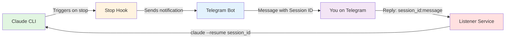

# Claude-Telegram Bridge 🤖💬

A seamless 2-way communication system between Claude Code and Telegram, enabling remote interaction with your AI assistant from anywhere in the world.


## 🌟 Features

- **📱 Real-time Notifications**: Get Telegram messages whenever Claude completes a response
- **🔄 2-Way Communication**: Reply from Telegram to continue conversations seamlessly
- **📝 Markdown Formatting**: Preserves Claude's formatting (bold, italic, code, headers)
- **🔍 Session Management**: Unique session IDs prevent multi-session conflicts
- **📊 History Viewing**: Review Telegram conversations with `show-telegram` command
- **🚀 Always Running**: Background listener works immediately or years later
- **🎯 Simple & Clean**: Minimal setup, no complex dependencies

## 🎬 Quick Demo

```
Terminal: claude "Help me debug this Python code"
Telegram: 🤖 Session abc123 - my_project (14:30)

         I'll help you debug your Python code...
         [Claude's formatted response]

         Reply: abc123:your message

You: abc123:what about line 42?
Terminal: [Session continues automatically with your question]
```

## 🚀 Quick Start

### Prerequisites

- Python 3.7+
- Claude Code CLI installed and configured
- Telegram account
- macOS or Linux (Windows support coming soon)

### Installation

1. **Clone the repository**
   ```bash
   git clone https://github.com/blueman82/claude-telegram-bridge.git
   cd claude-telegram-bridge
   ```

2. **Create your Telegram bot**
   - Message [@BotFather](https://t.me/botfather) on Telegram
   - Use `/newbot` command
   - Save your API token

3. **Run the automated setup script**
   ```bash
   chmod +x setup.sh
   ./setup.sh
   ```

   The script will:
   - Install Python dependencies
   - Copy scripts to correct locations
   - Configure your Telegram bot
   - Add convenient aliases to your shell
   - Start the background listener

   Or follow [manual setup instructions](SETUP.md) if you prefer

4. **Start using!**
   ```bash
   claude "Hello from Claude-Telegram!"
   ```

## 📖 Documentation

- [Full Setup Guide](SETUP.md) - Detailed installation and configuration
- [Troubleshooting](SETUP.md#troubleshooting) - Common issues and solutions
- [Security Notes](SETUP.md#security-notes) - Best practices


## 🏗️ Architecture




### Components

- **Stop Hook** (`stop.py`): Runs after each Claude response, sends notifications
- **Listener Service** (`telegram_listener_simple.py`): Monitors for Telegram replies
- **Show History** (`show-telegram.py`): View conversation history

## 💡 Usage Examples

### Basic Conversation
```bash
# Start a session
claude "Explain quantum computing"

# Reply from Telegram
# 81950c:can you give a simpler explanation?
```

### View Conversation History
```bash
# Show what happened in a Telegram session
show-telegram 81950c
```

### Check System Status

The setup script adds these aliases to your shell:
```bash
# Start the background listener
telegram-start

# Stop the listener
telegram-stop

# Check if listener is running
telegram-status

# View conversation history
show-telegram <session_id>
```

**Important:** After running setup.sh, reload your shell:
```bash
# For zsh (macOS default)
source ~/.zshrc

# For bash
source ~/.bashrc

# Or just open a new terminal
```

## 🔧 Configuration

### Environment Variables

Create `~/.claude/.env`:
```env
TELEGRAM_API=your_bot_token_here
```

### Chat ID

Store your Telegram chat ID in `~/.claude/.chat_id`:
```bash
echo "YOUR_CHAT_ID" > ~/.claude/.chat_id
```

## 🐛 Known Issues

- Markdown parsing conflicts with special characters in Claude's responses
- Stop hook only triggers when Claude finishes responding
- Replies must use exact format: `session_id:message`

## 🎆 Features in Detail

### Session Management
- Each Claude session gets a unique 6-character ID
- Sessions persist across terminal and Telegram
- Multiple concurrent sessions supported without conflicts
- Session history stored in `~/.claude/.sessions`

### Formatting Support
- **Bold text** preserved from Claude's markdown
- *Italic text* converted properly
- `Code blocks` maintained in monospace
- Headers converted to bold for Telegram compatibility
- Lists converted to bullet points

### Hook Safety
- **Setup script preserves existing Claude hooks**
- Appends our stop hook without overwriting others
- Non-destructive configuration updates
- Checks for existing configuration before modifying

## 🤝 Contributing

Contributions are welcome! Please feel free to submit a Pull Request.

1. Fork the repository
2. Create your feature branch (`git checkout -b feature/AmazingFeature`)
3. Commit your changes (`git commit -m 'Add some AmazingFeature'`)
4. Push to the branch (`git push origin feature/AmazingFeature`)
5. Open a Pull Request

## 📄 License

This project is licensed under the MIT License - see the [LICENSE](LICENSE) file for details.

## 🙏 Acknowledgments

- Built for [Claude Code](https://github.com/anthropics/claude-code) by Anthropic
- Telegram Bot API for reliable messaging
- The Claude community for inspiration

## 📬 Support

- Open an issue for bugs or feature requests
- Check [existing issues](https://github.com/yourusername/claude-telegram-bridge/issues) before creating new ones
- For setup help, see the [troubleshooting guide](SETUP.md#troubleshooting)

## 🚦 Status


---

**Made with ❤️ for seamless AI communication**

*Never lose context again - continue your Claude conversations from anywhere!*